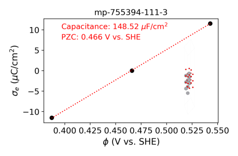

# Demo of ETL workflow for investigating electrochemical oxide materials

## 1. Walkthrough (5-minutes read)

### A. Intro
Electrodes are the building block for battery and electrocatalysis applications.
Among electrode materials, oxides are commonly encountered in water electrolysis for green $H_2$ production (e.g., iridium/nickel oxides).
Because oxide materials are vast and electrochemical experiments are time-consuming,
computational screening of oxide electrodes is among the cutting-edge ideas.
This demo illustrates a workflow that screens vanadium oxides for electrochemical properties.

### B. ETL workflow orchestration
This workflow—broadly classified as Extract-Transform-Load (ETL)—comprises of six steps:
1. Search for bulk vanadium oxides from the [Material Projects](https://next-gen.materialsproject.org/) using its [MP-API](https://next-gen.materialsproject.org/api).
2. Generate surfaces with different facets and termination  using [pymatgen](https://pymatgen.org/).
3. Run electrochemical grand-canonical DFT (GC-DFT) using [JDFTx](https://jdftx.org).
4. Analyze GC-DFT output for electrochemical potential of zero charge (PZC) and double-layer capacitance.
5. Load data to a [postgreSQL](https://www.postgresql.org/) database using SQL.
6. Print report.

[Apache-Airflow](https://airflow.apache.org/) is used for orchestrating the above ETL workflow.
Airflow DAG was created with the [TaskFlow API](https://airflow.apache.org/docs/apache-airflow/stable/tutorial/taskflow.html).


For demo purposes:
- Only vanadium (IV) oxides are searched.
- Only the (111) facet of 2 randomly picked bulk structures are generated.
- Minimal DFT settings (inaccurate but fast) are used on 1 randomly picked surface.
- A minimal postgres database using [psycopg](https://www.psycopg.org/docs/index.html) was implemented.
- The report is a simple figure with annotations and atomic structure, printed on a Markdown file.

### C. Folder tour
- The Airflow DAG is written in [/dags/my_dag.py](./dags/my_dag.py).
- Bulk structures from Materials Project are saved as POSCARs in [/output/bulk_poscars/](./output/bulk_poscars/).
- Surface/slab structures generated by pymatgen are saved in [/output/slab_poscars/](./output/slab_poscars/).
- GC-DFT input and output files are in [/output/gc_dft/](./output/gc_dft/).
- Generated output report is at [/output/report.md](./output/report.md)

### D. Output
GC-DFT computes the electrochemical potential of the generated oxide surface.
At no net charge, this gives the potential of zero charge (PZC).
The excess charges versus potentials should yield a linear line, of which the slope gives the electrochemical double-layer capacitance (see plot).



My work has shown the PZC and capacitance to be important descriptors for the adsorption thermodynamics and catalytic reaction kinetics.
\[[1](https://www.nature.com/articles/s42004-025-01579-y),
[2](https://pubs.rsc.org/en/content/articlehtml/2025/sc/d5sc03757c),
[3](https://pubs.acs.org/doi/abs/10.1021/acs.jpcc.4c01457),
[4](https://pubs.acs.org/doi/abs/10.1021/acs.jpclett.4c01032)\]

## 2. Reproduce (set-up: 20 minutes; run: 1-2 hours)

*Requirement*: [Docker](https://docs.docker.com/get-started/get-docker/)

1. Download this repository: 

```
git clone https://github.com/bolton2710/echem-dft-etl.git
```

2. Following this official [Airflow-Docker guide](https://airflow.apache.org/docs/apache-airflow/stable/howto/docker-compose/index.html),
initialize a unique Airflow ID: 
```
echo -e "AIRFLOW_UID=$(id -u)" > .env
```

3. Using [Docker CLI](https://docs.docker.com/reference/cli/docker/): 
```
docker compose up --build -d
```
This builds the Docker images and composes the container at the same time, which took me about 20-25 minutes.
The build written in [Dockerfile](./Dockerfile) uses the Airflow base-image with adding the JDFTx compilation.
The [docker-compose.yaml](./docker-compose.yaml) instructions follow Airflow's template, with addition of a second postgres (my_postgres) for saving the ETL output.

4. Open `http://localhost:8080/` in your browser, where Airflow GUI and control reside.

5. Navigate Airflow GUI menu to `Dags`. Here you'll see `dev-only` which I used for unit testing individual tasks. To fully reproduce the whole ETL workflow, go to `my-DAG`. 

6. This DAG does not have a set schedule for demo purposes. To run, click `Trigger`. *Warning*: the bottle-neck computation is the GC-DFT task, which could take up to two hours for certain samples.

7. Once the DAG run completed, output files are mounted locally to `./output/`.

8. Shutdown the container for the day:
```
docker compose down
```
Or clean up (reclaim spaces and memory) all containers and images:
```
docker system prune
```